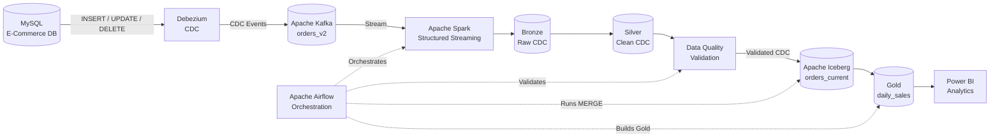

# Real-Time E-Commerce Data Engineering Platform

<p align="center">
  <strong>CDC • Real-Time Streaming • Lakehouse • Data Quality • Orchestration</strong>
</p>

<p align="center">
  MySQL → Debezium → Kafka → Spark → Apache Iceberg → Airflow → Analytics
</p>

---

## Overview

An end-to-end **data engineering platform** for processing real-time
e-commerce order data using **Change Data Capture (CDC)**, event streaming,
distributed processing, and a lakehouse architecture.

The platform captures row-level changes from **MySQL** using **Debezium**,
streams CDC events through **Apache Kafka**, processes them with
**Spark Structured Streaming**, and maintains analytical datasets using
**Apache Iceberg**.

The pipeline follows a **Bronze → Silver → Gold** architecture with
**incremental CDC processing, data-quality validation, and Airflow
orchestration**.

### What this project demonstrates

- Real-time MySQL CDC with Debezium
- Event streaming with Apache Kafka
- Spark Structured Streaming
- Bronze/Silver/Gold data architecture
- Incremental processing using Kafka offsets
- Iceberg-based current-state data management
- Data-quality validation
- Airflow pipeline orchestration
- Dockerized data engineering infrastructure

## 🏗️ Architecture

The platform uses an event-driven CDC pipeline to transform transactional
e-commerce data into analytics-ready lakehouse datasets.



### Data Flow

```text
MySQL
  ↓
Debezium CDC
  ↓
Kafka
  ↓
Spark Structured Streaming
  ↓
Bronze → Silver
  ↓
Data Quality Validation
  ↓
Iceberg Current State
  ↓
Gold Analytics
  ↓
Power BI
```

## 🧱 Data Architecture

> Bronze, Silver, Iceberg and Gold architecture will be documented here.

The platform follows a **Medallion-style architecture** to progressively
transform raw CDC events into reliable, analytics-ready datasets.

```text
                    MySQL CDC Events
                          │
                          ▼
              ┌──────────────────────┐
              │       Bronze         │
              │   Raw CDC Events     │
              │      Parquet         │
              └──────────┬───────────┘
                         │
                         ▼
              ┌──────────────────────┐
              │       Silver         │
              │ Cleaned & Normalized │
              │      CDC Data        │
              └──────────┬───────────┘
                         │
                         ▼
              ┌──────────────────────┐
              │   Iceberg Current    │
              │     orders_current   │
              │   Latest Order State │
              └──────────┬───────────┘
                         │
                         ▼
              ┌──────────────────────┐
              │        Gold          │
              │      daily_sales     │
              │ Analytics Aggregates │
              └──────────┬───────────┘
                         │
                         ▼
                    Power BI


## 🚀 Key Engineering Features

> Major engineering capabilities will be documented here.

- **Change Data Capture:** Captures MySQL `INSERT`, `UPDATE`, `DELETE`, and
  snapshot events using Debezium and publishes them to Kafka.

- **Real-Time Processing:** Processes CDC events using Spark Structured
  Streaming and persists raw events in the Bronze layer.

- **Medallion Architecture:** Separates raw, cleaned, and analytical data
  across Bronze, Silver, and Gold layers.

- **Incremental CDC Processing:** Uses Kafka offsets as a persistent
  watermark to process only newly arrived CDC events.

- **Iceberg Current-State Management:** Uses Apache Iceberg `MERGE`
  operations to apply CDC changes and maintain the latest order state.

- **Data Quality:** Validates processed data before it reaches downstream
  analytical datasets.

- **Pipeline Orchestration:** Uses Apache Airflow to coordinate Silver
  processing, quality validation, Iceberg updates, and Gold aggregation.

- **Containerized Infrastructure:** Runs the core streaming and processing
  infrastructure using Docker and Docker Compose.


## 🛠️ Technology Stack

> Technology stack will be documented here.

| Layer | Technologies |
|---|---|
| **Source** | MySQL |
| **CDC** | Debezium |
| **Streaming** | Apache Kafka |
| **Processing** | Apache Spark, PySpark, Structured Streaming |
| **Storage** | Parquet, Apache Iceberg |
| **Data Quality** | Great Expectations |
| **Orchestration** | Apache Airflow |
| **Infrastructure** | Docker, Docker Compose |
| **Analytics** | Power BI |
| **Development** | Python, SQL, Git, GitHub |


## 🔬 Pipeline Results

> End-to-end testing and validation will be documented here.
The pipeline was validated using real MySQL CDC operations and incremental
processing.

| Validation | Result |
|---|---|
| Initial CDC snapshot | ✅ Processed |
| New order insertion | ✅ Captured and processed |
| Order update | ✅ Applied to Iceberg |
| Order deletion | ✅ Propagated to current state |
| Kafka offset watermarking | ✅ Incremental processing |
| Silver data validation | ✅ Passed |
| Iceberg current-state table | ✅ Maintained |
| Gold daily-sales aggregation | ✅ Generated |
| Airflow pipeline | ✅ Completed successfully |

### Gold Analytics

The Gold layer produces analytics-ready daily metrics including:

- Total orders
- Unique customers
- Total revenue
- Average order value


## 📊 Analytics

The Gold layer produces analytics-ready datasets designed for business
intelligence and visualization.

The primary analytical dataset is:

- **`daily_sales`** — daily order volume, unique customers, total revenue,
  and average order value.

### Power BI Visualization

The Gold Iceberg datasets will be connected to **Power BI** to build an
interactive analytics dashboard.

Planned visualizations include:

- 📈 Daily revenue trends
- 📦 Daily order volume
- 👥 Unique customers
- 💰 Average order value
- 📊 Sales performance over time

```text
MySQL
  ↓
Debezium → Kafka
  ↓
Spark
  ↓
Bronze → Silver
  ↓
Iceberg Current State
  ↓
Gold: daily_sales
  ↓
Power BI
  ↓
Interactive Analytics Dashboard


## 📂 Project Structure

> Repository structure will be documented here.

```text
realtime-ecommerce-data-platform/
│
├── airflow/
│   └── dags/
│       └── ecommerce_cdc_pipeline.py
│
├── spark/
│   └── jobs/
│       ├── debezium_orders_streaming.py
│       ├── debezium_orders_silver.py
│       ├── debezium_orders_iceberg_incremental.py
│       └── iceberg_gold_daily_sales.py
│
├── quality/
│   └── checks/
│       ├── validate_silver.py
│       └── gold_quality.py
│
├── src/
│   ├── database/
│   └── generators/
│
├── infrastructure/
│   └── docker/
│
├── data/
│
├── docker-compose.yml
├── requirements.txt
├── .gitignore
└── README.md
```

### Core Components

| Component | Responsibility |
|---|---|
| `airflow/dags` | Pipeline orchestration |
| `spark/jobs` | Streaming, transformation, CDC merge and Gold processing |
| `quality/checks` | Data-quality validation |
| `src` | Database utilities and data generation |
| `infrastructure` | Docker infrastructure configuration |
| `data` | Local Bronze/Silver/processing data |


## Quick Start

### Prerequisites

- Docker Desktop
- MySQL 8+
- Python 3.11+
- Git

### 1. Clone the repository

```bash
git clone https://github.com/pratikthokal-dev/realtime-ecommerce-data-platform.git
cd realtime-ecommerce-data-platform
```

### 2. Configure environment variables

Create a local `.env` file with your MySQL configuration:

```env
MYSQL_HOST=localhost
MYSQL_PORT=3306
MYSQL_USER=<your_mysql_user>
MYSQL_PASSWORD=<your_mysql_password>
MYSQL_DATABASE=ecommerce_platform
```

> Never commit `.env` or database credentials to Git.

### 3. Start the infrastructure

```powershell
docker compose up -d
```

This starts the Kafka, Debezium, Spark, Airflow, and supporting services.

### 4. Start CDC streaming

```powershell
docker compose up -d spark-streaming
```

### 5. Open Airflow

Open:

```text
http://localhost:8082
```

Trigger the:

```text
ecommerce_cdc_pipeline
```

DAG.

### 6. Generate or modify order data

Changes made to the MySQL `orders` table are captured by Debezium and
processed through the CDC pipeline.


## ⚙️ Engineering Challenges

> Important implementation challenges and solutions will be documented here.

### 1. Incremental CDC State Management

CDC events are continuously produced by Kafka, so reprocessing the entire
dataset on every pipeline run would be inefficient.

The pipeline maintains a persistent **Kafka offset watermark** and processes
only CDC events that arrived after the last successfully processed offset.

### 2. Applying CDC Operations to Current State

Debezium produces different event types such as `INSERT`, `UPDATE`, `DELETE`,
and snapshot events.

The Iceberg layer uses conditional `MERGE` logic to apply these events and
maintain a reliable `orders_current` table representing the latest state.

### 3. Data Quality Across Pipeline Layers

Data is validated after Silver processing before being used by downstream
analytical datasets.

This helps detect invalid records before they propagate into the Iceberg
current-state and Gold analytical layers.

### 4. Dependency-Based Pipeline Orchestration

The complete processing flow contains multiple dependent stages.

Airflow coordinates the pipeline as:

```text
CDC Silver
    ↓
Data Quality
    ↓
Iceberg CDC MERGE
    ↓
Gold Aggregation


## 📈 Future Improvements

> Future improvements will be documented here.

- **Cloud Lakehouse:** Migrate the storage and catalog layer to AWS S3,
  AWS Glue, and Amazon Athena.

- **Cloud Monitoring:** Add centralized monitoring, alerting, and pipeline
  observability using AWS services.

- **CI/CD:** Introduce automated testing and deployment workflows using
  GitHub Actions.

- **Failure Recovery:** Add a dedicated dead-letter queue (DLQ) and
  improved recovery mechanisms for failed CDC events.

- **Automated Testing:** Expand unit, integration, and end-to-end testing
  across the CDC, transformation, and data-quality layers.

- **Production Observability:** Add structured logging, pipeline metrics,
  data-lineage tracking, and operational dashboards.

## 👨‍💻 Author

**Pratik Thokal**

Data Engineering • Big Data • Cloud • Python • SQL