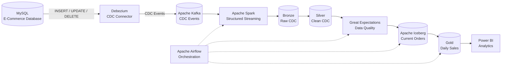

# Real-Time E-Commerce Data Engineering Platform

**End-to-End CDC • Streaming • Lakehouse • Data Quality • Orchestration**

MySQL → Debezium → Kafka → Spark → Apache Iceberg → Airflow → Analytics

---

## 📌 Overview

The **Real-Time E-Commerce Data Engineering Platform** is an end-to-end
data engineering system designed to capture, process, validate, and
transform real-time e-commerce transactional data into analytics-ready
datasets.

The platform captures database changes from MySQL using **Change Data
Capture (CDC)** with Debezium, streams those events through Apache Kafka,
processes them using Apache Spark, and maintains analytical data using
Apache Iceberg.

The pipeline follows a **Bronze → Silver → Gold** architecture and uses
Apache Airflow for workflow orchestration and data-quality validation.

---

## 🏗️ Architecture

> Architecture diagram will be added in the next section.
## 🏗️ Architecture

The platform follows an event-driven data engineering architecture that
captures transactional changes from MySQL, streams them through Kafka,
processes them using Spark, and builds an Iceberg-based analytical
lakehouse.

---

## 🔄 Data Flow

> Detailed data flow diagram will be added here.

---

## 🧱 Data Architecture

> Bronze, Silver, Iceberg and Gold architecture will be documented here.

---

## ⚡ Change Data Capture

> Debezium CDC lifecycle will be documented here.

---

## 🔁 Incremental Processing

> Kafka offset and CDC watermark processing will be documented here.

---

## 📊 Analytics

> Gold-layer analytics and Power BI integration will be documented here.

---

## 🛠️ Technology Stack

> Technology stack will be documented here.

---

## 📂 Project Structure

> Repository structure will be documented here.

---

## 🚀 Key Engineering Features

> Major engineering capabilities will be documented here.

---

## 🧪 Data Quality

> Data-quality validation will be documented here.

---

## ▶️ Getting Started

> Installation and setup instructions will be documented here.

---

## 🔬 Pipeline Testing

> End-to-end testing and validation will be documented here.

---

## ⚙️ Engineering Challenges

> Important implementation challenges and solutions will be documented here.

---

## 📈 Future Improvements

> Future improvements will be documented here.

---

## 👨‍💻 Author

**Pratik Thokal**

Data Engineering • Big Data • Cloud • Python • SQL