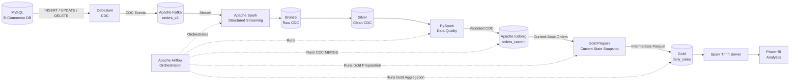
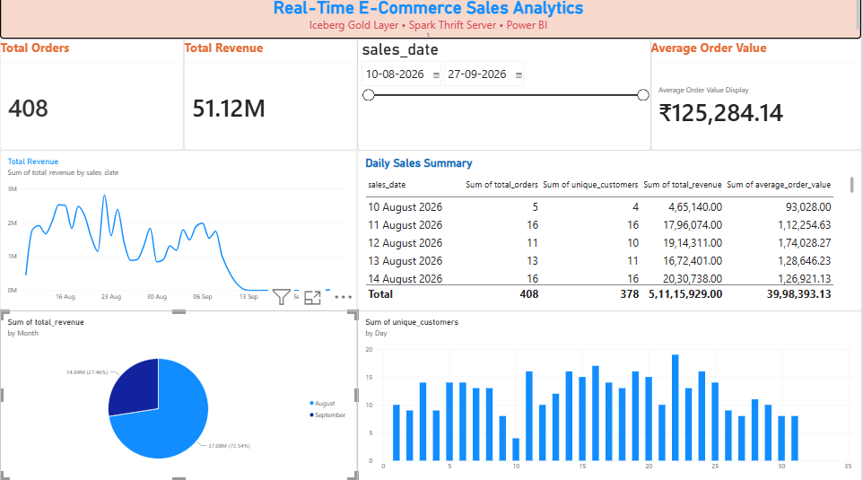

# Real-Time E-Commerce Data Engineering Platform

<p align="center">
  <strong>CDC • Real-Time Streaming • Lakehouse • Data Quality • Orchestration</strong>
</p>

<p align="center">
  MySQL → Debezium → Kafka → Spark → Apache Iceberg → Airflow → Analytics
</p>

---

## Overview

An end-to-end **data engineering platform** for processing real-time
e-commerce order data using **Change Data Capture (CDC)**, event streaming,
distributed processing, lakehouse storage, data-quality validation, workflow
orchestration, and business intelligence.

The platform captures row-level changes from **MySQL** using **Debezium**,
publishes CDC events through **Apache Kafka**, processes them with
**Apache Spark**, validates Silver-layer data using **PySpark-based quality
checks**, and maintains the latest order state in **Apache Iceberg**.

The pipeline follows a **Bronze → Silver → Current State → Gold** architecture.
**Apache Airflow** orchestrates the complete workflow from CDC processing
through validation, Iceberg state management, and Gold analytics generation.

The Gold layer produces daily sales metrics that are exposed to **Power BI**
through the Spark SQL/Thrift serving layer. The project also includes
Trino/Nessie infrastructure, pipeline monitoring utilities, automated tests,
and a fully containerized local development environment.

### What this project demonstrates

- Real-time MySQL CDC with Debezium
- Event streaming with Apache Kafka
- Spark Structured Streaming and PySpark transformations
- Bronze/Silver/Gold lakehouse architecture
- Incremental CDC processing using Kafka offsets
- Apache Iceberg current-state management with CDC MERGE operations
- PySpark-based data-quality validation
- Airflow DAG orchestration with dependent processing stages
- Gold-layer daily sales aggregation
- Spark Thrift Server connectivity for BI workloads
- Power BI analytics integration
- Trino/Nessie analytical infrastructure
- Pipeline monitoring and automated testing
- Dockerized data engineering infrastructure
---

## 🏗️ Architecture


```mermaid
flowchart LR
    A[(MySQL<br/>E-Commerce DB)]
    B[Debezium<br/>CDC]
    C[(Apache Kafka<br/>orders_v2)]

    D[Apache Spark<br/>Structured Streaming]
    E[(Bronze<br/>Raw CDC)]
    F[(Silver<br/>Clean CDC)]
    G[PySpark<br/>Data Quality]

    H[(Apache Iceberg<br/>orders_current)]

    P[Gold Prepare<br/>Current-State Snapshot]
    I[(Gold<br/>daily_sales)]

    T[Spark Thrift Server]
    J[Power BI<br/>Analytics]

    K[Apache Airflow<br/>Orchestration]

    A -->|INSERT / UPDATE / DELETE| B
    B -->|CDC Events| C
    C -->|Stream| D
    D --> E
    E --> F
    F --> G
    G -->|Validated CDC| H

    H -->|Current-State Orders| P
    P -->|Intermediate Parquet| I
    I --> T
    T --> J

    K -.->|Orchestrates| D
    K -.->|Runs| G
    K -.->|Runs CDC MERGE| H
    K -.->|Runs Gold Preparation| P
    K -.->|Runs Gold Aggregation| I
```

### Data Flow

```text
MySQL
  ↓
Debezium CDC
  ↓
Kafka
  ↓
Spark Structured Streaming
  ↓
Bronze → Silver
  ↓
Data Quality Validation
  ↓
Iceberg Current State
  ↓
Gold Preparation
  ↓
Gold Daily Sales
  ↓
Spark Thrift Server
  ↓
Power BI
```


---

## 🧱 Data Architecture

The platform follows a **Medallion-style architecture** to progressively transform raw CDC events into reliable, analytics-ready datasets.

```text
                    MySQL CDC Events
                           │
                           ▼
              ┌──────────────────────┐
              │       Bronze         │
              │   Raw CDC Events     │
              │      Parquet         │
              └──────────┬───────────┘
                         │
                         ▼
              ┌──────────────────────┐
              │       Silver         │
              │ Cleaned & Normalized │
              │      CDC Data        │
              └──────────┬───────────┘
                         │
                         ▼
              ┌──────────────────────┐
              │   Iceberg Current    │
              │    orders_current    │
              │  Latest Order State  │
              └──────────┬───────────┘
                         │
                         ▼
              ┌──────────────────────┐
              │        Gold          │
              │      daily_sales     │
              │ Analytics Aggregates │
              └──────────┬───────────┘
                         │
                         ▼
              ┌──────────────────────┐
              │  Spark Thrift Server │
              │    BI Serving Layer  │
              └──────────┬───────────┘
                         │
                         ▼
                      Power BI
```

### Data Layers

| Layer             | Purpose                                                                                            | Format / Technology |
| ----------------- | -------------------------------------------------------------------------------------------------- | ------------------- |
| **Bronze**        | Stores raw Debezium CDC events with Kafka metadata                                                 | Parquet             |
| **Silver**        | Cleans, normalizes, and prepares CDC records for downstream processing                             | Parquet             |
| **Current State** | Applies incremental `INSERT`, `UPDATE`, and `DELETE` operations to maintain the latest order state | Apache Iceberg      |
| **Gold**          | Produces analytics-ready business aggregates such as daily sales metrics                           | Apache Iceberg      |
| **Serving**       | Exposes Gold analytics to the BI layer through SQL connectivity                                    | Spark Thrift Server |


## 🚀 Key Engineering Features

* **Change Data Capture:** Captures MySQL `INSERT`, `UPDATE`, `DELETE`, and snapshot events using Debezium and publishes them to Kafka.

* **Real-Time Processing:** Processes CDC events using Spark Structured Streaming and persists raw events in the Bronze layer.

* **Medallion Architecture:** Separates raw, cleaned, current-state, and analytical data across Bronze, Silver, Iceberg Current State, and Gold layers.

* **Incremental CDC Processing:** Uses Kafka offsets as a persistent watermark to process only newly arrived CDC events.

* **Iceberg Current-State Management:** Uses Apache Iceberg `MERGE` operations to apply CDC changes and maintain the latest order state.

* **Data Quality Validation:** Uses PySpark-based validation checks to detect missing fields, invalid values, invalid CDC operations, and duplicate Kafka events before downstream processing.

* **Airflow Orchestration:** Uses Apache Airflow to coordinate the complete pipeline from Silver processing through data-quality validation, Iceberg updates, and Gold analytics.

* **Separated Gold Processing:** Uses dedicated Gold preparation and aggregation jobs to isolate current-state reads from analytical aggregation workloads.

* **BI Serving Layer:** Uses Spark Thrift Server to expose Gold analytics for SQL-based BI consumption.

* **Power BI Integration:** Connects Power BI to the `daily_sales_powerbi` view backed by the Gold Iceberg table.

* **Pipeline Monitoring:** Includes a pipeline health-check utility for monitoring the data platform.

* **Automated Testing:** Includes automated tests for validating important CDC pipeline behavior.

* **Containerized Infrastructure:** Runs the core streaming, processing, orchestration, and serving infrastructure using Docker and Docker Compose.


## 🛠️ Technology Stack

| Layer                    | Technologies                                         |
| ------------------------ | ---------------------------------------------------- |
| **Source**               | MySQL                                                |
| **CDC**                  | Debezium                                             |
| **Streaming**            | Apache Kafka                                         |
| **Processing**           | Apache Spark, PySpark, Structured Streaming          |
| **Storage**              | Parquet, Apache Iceberg                              |
| **Data Quality**         | PySpark-based validation                             |
| **Orchestration**        | Apache Airflow                                       |
| **Infrastructure**       | Docker, Docker Compose, Trino / Nessie configuration |
| **Analytics / BI**       | Power BI, Spark Thrift Server                        |
| **Monitoring / Testing** | Python health checks, automated pipeline tests       |
| **Development**          | Python, SQL, Git, GitHub                             |

---

## 🔬 Pipeline Results

The pipeline was validated using real MySQL CDC operations and incremental processing.

| Validation                        | Result                        |
| --------------------------------- | ----------------------------- |
| Initial CDC snapshot              | ✅ Processed                   |
| New order insertion               | ✅ Captured and processed      |
| Order update                      | ✅ Applied to Iceberg          |
| Order deletion                    | ✅ Propagated to current state |
| Kafka offset watermarking         | ✅ Incremental processing      |
| Silver data validation            | ✅ Passed                      |
| Iceberg current-state table       | ✅ Maintained                  |
| Gold preparation                  | ✅ Completed successfully      |
| Gold daily-sales aggregation      | ✅ Generated                   |
| Spark Thrift Server serving layer | ✅ Verified                    |
| Power BI integration              | ✅ Connected and refreshed     |
| Airflow end-to-end pipeline       | ✅ Completed successfully      |


### Gold Analytics

The Gold layer provides business-ready daily sales metrics:

* **Total orders**
* **Unique customers**
* **Total revenue**
* **Average order value**

These metrics are stored in the Iceberg `daily_sales` table and exposed to Power BI through the Spark Thrift Server.


## 📊 Analytics

The Gold layer provides analytics-ready datasets for business intelligence
and visualization.

### 📌 Gold Analytics Dataset

The primary analytical dataset is:

| Dataset | Metrics |
|---|---|
| `daily_sales` | Total orders, unique customers, total revenue, average order value |

### 🔄 Analytics Flow

```text
┌─────────────────────────┐
│     Apache Iceberg      │
│                         │
│   Gold: daily_sales     │
└────────────┬────────────┘
             │
             ▼
┌─────────────────────────┐
│   Spark Thrift Server   │
│                         │
│      BI Serving         │
└────────────┬────────────┘
             │
             ▼
┌─────────────────────────┐
│        Power BI         │
│                         │
│   Data Connection       │
└────────────┬────────────┘
             │
             ▼
┌─────────────────────────┐
│  Interactive Dashboard  │
│                         │
│  📈 Revenue Trends      │
│  📦 Order Volume        │
│  👥 Customer Analysis   │
│  💰 Average Order Value │
│  📊 Sales Performance   │
└─────────────────────────┘
```
### 📊 Power BI Dashboard

The Gold `daily_sales` dataset is consumed through Spark Thrift Server and
visualized in Power BI.



[**Download Power BI Dashboard (.pbix)**](assets/realtime-ecommerce-platform-dashboard.pbix)

## 📂 Project Structure

```text
realtime-ecommerce-data-platform/
│
├── airflow/
│   └── dags/
│       └── ecommerce_cdc_pipeline.py
│
├── spark/
│   └── jobs/
│       ├── debezium_orders_streaming.py
│       ├── debezium_orders_silver.py
│       ├── debezium_orders_iceberg_incremental.py
│       ├── gold_prepare.py
│       └── gold_daily_sales.py
│
├── quality/
│   └── checks/
│       └── validate_silver.py
│
├── src/
│   ├── database/
│   └── generators/
│
├── infrastructure/
│   ├── docker/
│   └── trino/
│       ├── catalog/
│       ├── config.properties
│       ├── jvm.config
│       └── node.properties
│
├── monitoring/
│   └── pipeline_health_check.py
│
├── tests/
│   └── test_cdc_pipeline.py
│
├── data/
│
├── reset_cdc_watermark.py
├── docker-compose.yml
├── requirements.txt
├── .gitignore
└── README.md
```

### Core Components

| Component        | Responsibility                                                   |
| ---------------- | ---------------------------------------------------------------- |
| `airflow/dags`   | End-to-end pipeline orchestration                                |
| `spark/jobs`     | Streaming, Silver transformation, CDC merge, and Gold processing |
| `quality/checks` | PySpark-based data-quality validation                            |
| `src`            | Database utilities and test-data generation                      |
| `infrastructure` | Docker and Trino configuration                                   |
| `monitoring`     | Pipeline health checks                                           |
| `tests`          | Automated pipeline tests                                         |
| `data`           | Local Bronze, Silver, Gold, and Iceberg data                     |

---

## Quick Start

### Prerequisites

- Docker Desktop
- MySQL 8+
- Python 3.11+
- Git

### 1. Clone the repository

```bash
git clone https://github.com/pratikthokal-dev/realtime-ecommerce-data-platform.git
cd realtime-ecommerce-data-platform
```

### 2. Configure environment variables

Create a local `.env` file with your MySQL configuration:

```env
MYSQL_HOST=localhost
MYSQL_PORT=3306
MYSQL_USER=<your_mysql_user>
MYSQL_PASSWORD=<your_mysql_password>
MYSQL_DATABASE=ecommerce_platform
```

> Never commit `.env` or database credentials to Git.

### 3. Start the infrastructure

```powershell
docker compose up -d
```

This starts the Kafka, Debezium, Spark, Airflow, and supporting services.

### 4. Start CDC streaming

```powershell
docker compose up -d spark-streaming
```

### 5. Open Airflow

Open:

```text
http://localhost:8082
```

Trigger the:

```text
ecommerce_cdc_pipeline
```

DAG.

### 6. Generate or modify order data

Changes made to the MySQL `orders` table are captured by Debezium and
processed through the CDC pipeline.

---

## ⚙️ Engineering Challenges

### 1. Incremental CDC State Management

CDC events are continuously produced by Kafka, so reprocessing the entire dataset on every pipeline run would be inefficient.

The pipeline maintains a persistent **Kafka offset watermark** and processes only CDC events that arrived after the last successfully processed offset.

### 2. Applying CDC Operations to Current State

Debezium produces different event types such as `INSERT`, `UPDATE`, `DELETE`, and snapshot events.

The Iceberg layer uses conditional `MERGE` logic to apply these events and maintain the `orders_current` table representing the latest state of each order.

### 3. Data Quality Across Pipeline Layers

Data is validated after Silver processing before being used by downstream analytical datasets.

PySpark validation checks required fields, order values, statuses, CDC operations, and duplicate Kafka events to prevent invalid records from propagating into the Iceberg and Gold layers.

### 4. Dependency-Based Pipeline Orchestration

The complete processing flow contains multiple dependent stages.

Airflow coordinates the pipeline as:

```text id="yzz2rj"
CDC Silver
    ↓
Data Quality
    ↓
Iceberg CDC MERGE
    ↓
Gold Preparation
    ↓
Gold Daily Sales
```

This makes the processing workflow reproducible, dependency-aware, and easier to monitor.

---

## 📈 Future Improvements

* **Cloud Lakehouse:** Migrate the local lakehouse to AWS S3 with AWS Glue and Amazon Athena.

* **Cloud Monitoring:** Add centralized monitoring, alerting, and operational observability using AWS services.

* **CI/CD:** Introduce automated build, testing, and deployment workflows using GitHub Actions.

* **Failure Recovery:** Add a dedicated Dead-Letter Queue (DLQ) and stronger recovery mechanisms for failed CDC events.

* **Expanded Testing:** Extend the existing automated tests with broader unit, integration, and end-to-end coverage.

* **Production Observability:** Add structured logging, pipeline metrics, data lineage, and operational dashboards.

---

## 👨‍💻 Author

**Pratik Thokal**

B.E. Information Technology Student | Aspiring Data Engineer

* GitHub: [pratikthokal-dev](https://github.com/pratikthokal-dev)
* Focus Areas: Data Engineering, Big Data, Cloud, SQL, Python, Apache Spark

